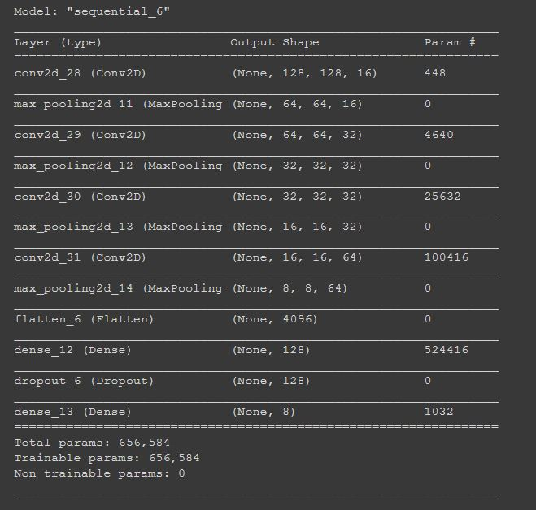
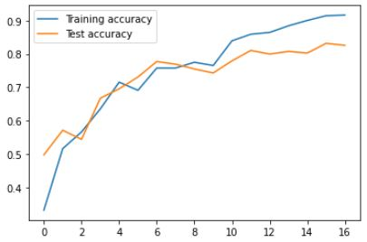
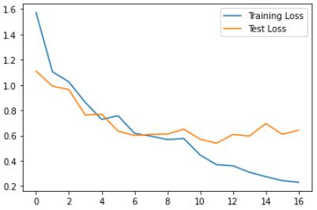
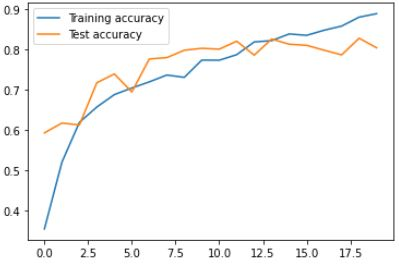
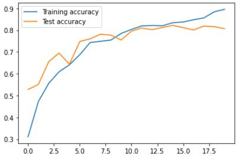
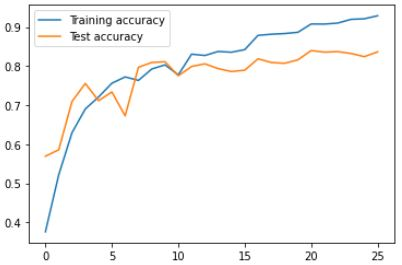
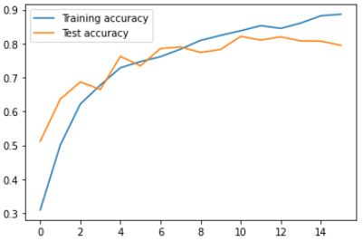

# Image Classification challenge (Assgnment 4 & 5)

## Introduction

Image classification is the task of identifying images and categorizing them in one of several predefined distinct classes. It has wide range of applications in every industry from gaming to medical.
Image classification can be done by extracting good features out of image and using them to predict the class of test image. These features can be surf, sift kind of features.
Here we have done image classification through CNNs. They learn filter values automatically to learn features and follow a feature hierarchy. The dataset that we have used is of colorectal cancer histology.

## Approach

- Dataset was splitted into 80-20 ratio of train and test
- As mentioned in introduction, we have used a CNN model for image classification. Here is our model summary :

- So the main task was to tune many hyper-parameters for our model and select the best set of hyper-parameters . Here are the hyper-parameters that we have tuned.
  - Number of Conv Layers: 4 layers (16,32,64,128)
  - Filter sizes :3,3,5,7 respectively for each conv layer.
  - Dense Layer :2 dense layers having 128 and 8 neurons respectively .Notice we have 8 labels in the end thats why 8 neourons in the last layer. 
  - Dropout :Dropout fraction of "0.5" was used in our model 
  - Optimizer :Adam Optimizer 
- Notice that the comparisions results are shown in the results section 

## Results
- Accuracy of our Model :  

- Loss : 

Now comparision with different Models , i.e hyperparameter tuning and selection of best set 
- Number of conv layers 
  - 3 Layers (16,32,64) :  
    
  - 5 Layers (16,32,32,64,128):  
    
- Filter sizes
Here is the comparision with the choice of filtyer size of 3 throughout all layers:  

- Dense Layer
Here is the reult if one more dense layer is added having 256 neurons   

- Dropout
  - Dropout = 0.1:  
    _acc.JPG)
    
  - Dropout = 0.8:  
    _acc.JPG)

## Installation

The Coding was done on google colaboratary using free GPU available.
Here are some of the dependencies that u may need to install while using this code in the local enviornment:

- Conda
- Tensorflow
- Numpy
- MatplotLib

Please refer to requirnments.txt file for more details. 
Go  to the directory where requirements.txt is located.  
Activate your conda enviornment. 
Run: conda install -r requirements.txt in your shell.

## References

- [Data-Set](https://www.tensorflow.org/datasets/catalog/colorectal_histology)
- [Tensorflow Model Documentation](https://www.tensorflow.org/api_docs/python/tf/keras/Model)
- [Tensforflow Dataset(TFDS) Documentation](https://www.tensorflow.org/datasets/api_docs/python/tfds)

